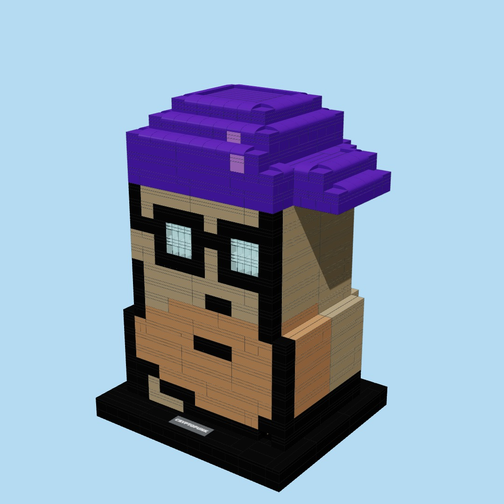
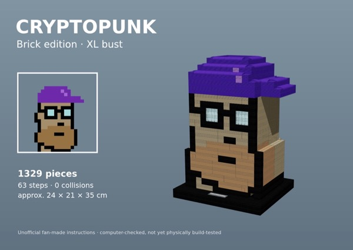
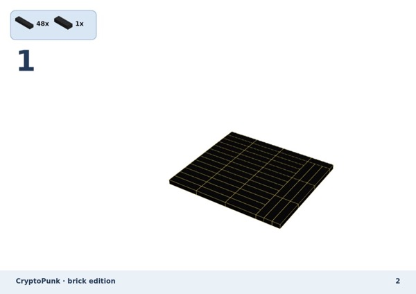
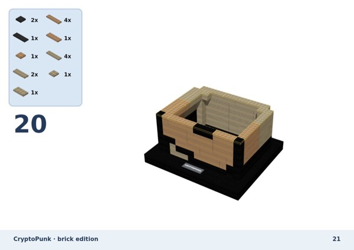
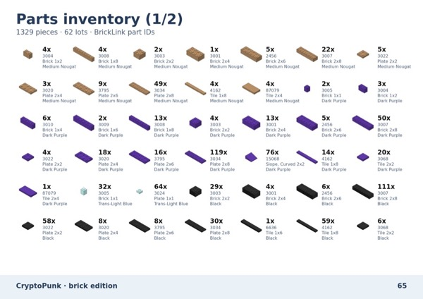

# CryptoPunk — Brick Edition (XL bust)

A brick-built bust of my CryptoPunk, designed with Claude from the original 24×24 pixel image.
Inspired by [@victormustar](https://x.com/victormustar)'s Microduck.

## 📘 Build instructions (66-page PDF)

**[Read the booklet online](instructions/cryptopunk_XL_instructions.pdf)** · **[Download the PDF](https://github.com/hs7j4yk4sz-boop/cryptopunk-brick-bust/releases/latest/download/cryptopunk_XL_instructions.pdf)** · [BrickLink wanted list](parts/bricklink_wanted_list.xml)

| | |
|---|---|
| Pieces | 1,329 standard parts (62 lots) |
| Steps | 63 |
| Size | approx. 24 × 21 × 35 cm |
| Checks | 12,672 stud connections, 0 collisions, 0 floating parts |

## Files

- `instructions/` — 66-page instruction booklet (PDF)
- `video/` — build animation (24 s, with sound)
- `parts/` — parts list (CSV) and BrickLink wanted list (XML: Want → Upload on BrickLink)
- `model/` — the full model as JSON (every part with position, size, colour, part ID) and the source pixel grid
- `tools/` — the scripts used to build the model, render the video and booklet, and generate the sound

## How it was made

1. Each pixel of the Punk becomes a 2×2-stud block, 5 plates tall (so pixels stay square).
2. The head is extruded to 20 studs deep, hollowed out with 2-stud walls, back corners chamfered.
3. Each layer is merged into real bricks and plates (layers alternate direction so they interlock), tops are finished with tiles and curved slopes on the cap.
4. A checker verifies every part is connected to the base, nothing overlaps, and the centre of mass sits over the base.

## ⚠️ Not physically build-tested

The model and the steps were checked on a computer only. Nobody has built it with real bricks yet.
Some colours (Dark Purple, Dark Tan) may be hard to find in large plates.

---

Unofficial fan-made project. Not produced, sponsored or endorsed by the LEGO Group or by the CryptoPunks project or its rights holders. LEGO® is a trademark of the LEGO Group.
